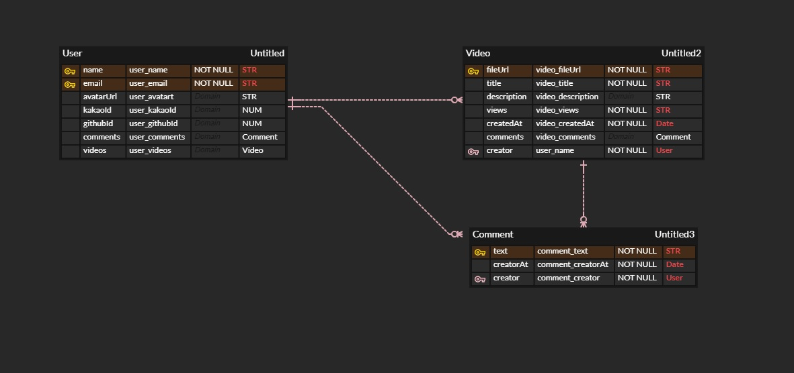

# WeTube
> NodeJS와 Express를 이용한 멀티미디어 홈페이지  

 

## 사용기술
- JS
- pug 3.0.0
- NodeJS 12.20.1
- SCSS
- ES6
- Express 4.17.1
- Babel 7
- Passport 0.4.1
- Webpack 5.21.2
- MongoDB 3.6.3
- Mongoose 5.11.14
- Multer 1.4.2
- Amazon S3

## ERD 설계

- User는 DB에 저장되며 사용자 이름과 e-mail을 필수로 합니다.
- video는 User 스키마 안에 있는 videos 배열에 저장되며 사용자 정보로 누구의 게시물인지 확인합니다.
- comment는 Video 스키마 안에 있는 comments 배열에 저장되며 사용자 정보로 누구의 댓글인지 확인합니다.

## 핵심기능
- 비디오 Create Read Update Delete 기능
- 카카오 계정 및 깃헙 계정으로 회원가입 가능
- 각종 데이터를 MongoDB Atlas에 저장
- Amazon S3에 업로드 영상 및 프로필 사진 저장
